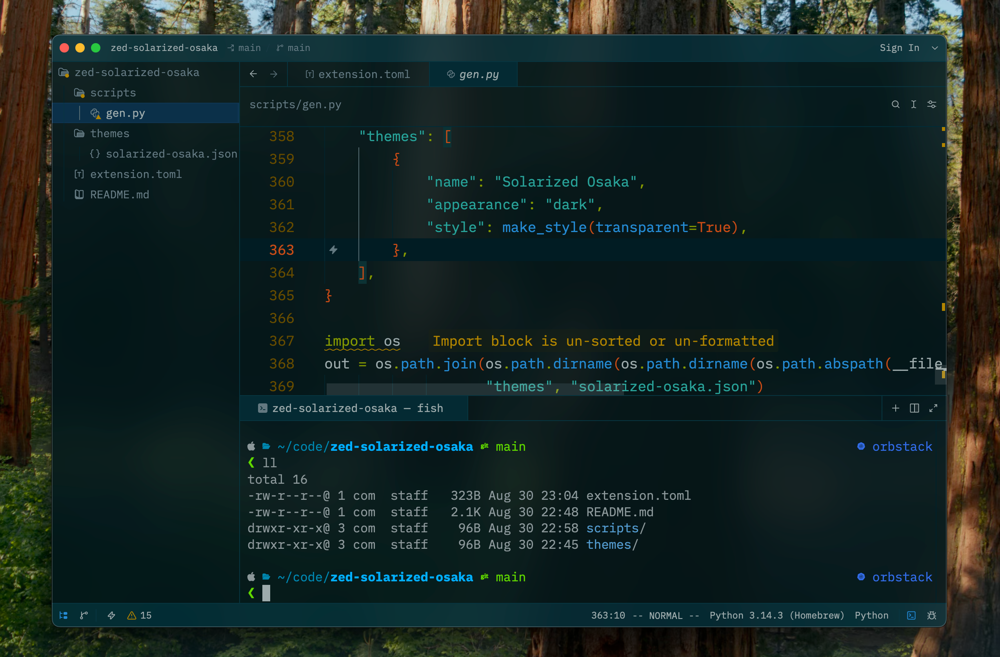

# Solarized Osaka for Zed

A [Zed](https://zed.dev) theme port of [craftzdog's **solarized-osaka.nvim**](https://github.com/craftzdog/solarized-osaka.nvim) colorscheme — a darker, more saturated take on Solarized.

This build ships the **dark** variant with **blur mode**: the window and editor
backgrounds are transparent and `background.appearance` is set to `blurred`, so on
macOS the editor picks up the system vibrancy/blur behind it.

## Preview



- **Background**: `#001419` (base04), rendered transparent + blurred
- **Foreground**: `#839395`
- **Accents**: cyan `#29a298` · blue `#268bd3` · green `#849900` · yellow `#b28500` · orange `#c94c16` · red `#db302d` · magenta `#d23681` · violet `#6d71c4`

## Syntax mapping

Faithful to the Neovim theme's highlight groups:

| Token group                         | Color            |
| ----------------------------------- | ---------------- |
| Comments                            | base01 (italic)  |
| Strings / constants / members       | cyan             |
| Functions / variables / properties  | blue             |
| Keywords / operators / punctuation delimiters | green  |
| Types / namespaces / tags           | yellow           |
| Constructors / parameters / brackets / builtins | orange |
| Preprocessor / attributes           | red              |

## Installing as a dev extension

1. Clone this repo.
2. In Zed, open the command palette → **`zed: install dev extension`**.
3. Select this folder.
4. Open the theme selector (`cmd-k cmd-t`) → choose **Solarized Osaka**.

### Getting the blur to show on macOS

Blur is driven by the theme's `background.appearance: "blurred"` plus the
transparent backgrounds — no extra config needed. If you want to tune how much
shows through, adjust the alpha values in `themes/solarized-osaka.json`
(e.g. the `#001419xx` backgrounds).

## Regenerating the theme

The theme JSON is generated from the upstream palette. See `scripts/gen.py`.

```sh
python3 scripts/gen.py
```

## Credits

- Original colorscheme: [craftzdog/solarized-osaka.nvim](https://github.com/craftzdog/solarized-osaka.nvim)
- Based on Ethan Schoonover's [Solarized](https://ethanschoonover.com/solarized/)
